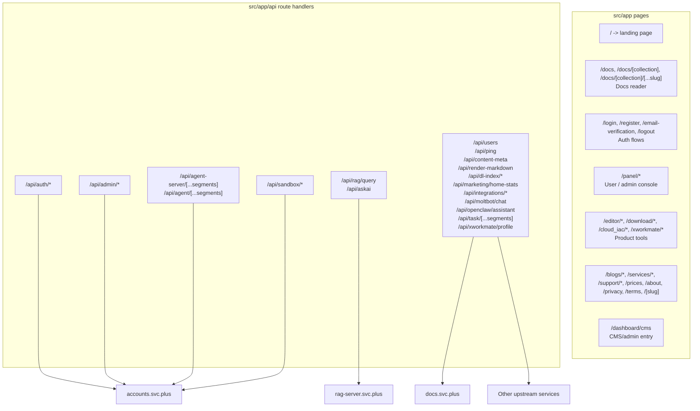

# console.svc.plus Web Console Architecture

## Scope

`console.svc.plus` is the browser-facing control plane. It is a Next.js App Router application that combines public pages, docs browsing, account/admin panels, and a BFF layer that forwards requests to downstream services.

## Architecture

## Frontend Routes

| Route family | Path | Purpose |
| --- | --- | --- |
| Home | `/` | Public landing page and site entry |
| Docs | `/docs`, `/docs/[collection]`, `/docs/[collection]/[...slug]` | Documentation reader, sidebar, and TOC |
| Auth | `/login`, `/register`, `/email-verification`, `/logout` | Sign in / sign up / email verification / session cleanup |
| Panel | `/panel`, `/panel/account`, `/panel/agent`, `/panel/api`, `/panel/appearance`, `/panel/ldp`, `/panel/management`, `/panel/subscription`, `/panel/[...segments]` | Signed-in account and admin console |
| Tools | `/editor`, `/editor/wechat`, `/editor/xiaohongshu`, `/download`, `/download/[...segments]`, `/cloud_iac`, `/cloud_iac/[provider]`, `/cloud_iac/[provider]/[service]`, `/xworkmate`, `/xworkmate/admin`, `/xworkmate/integrations` | Product tools and service explorers |
| Content | `/blogs`, `/blogs/[...slug]`, `/services`, `/services/openclaw`, `/services/insight`, `/support`, `/support/discussions`, `/about`, `/prices`, `/privacy`, `/terms`, `/[slug]` | Marketing / informational pages |
| Admin / CMS | `/dashboard/cms` | CMS or content-management entry |
| Error pages | `/404`, `/500` | Static error surfaces |

## BFF / API Routes

| API family | Path | Purpose | Upstream target |
| --- | --- | --- | --- |
| Auth | `/api/auth/login`, `/api/auth/register`, `/api/auth/register/send`, `/api/auth/register/verify`, `/api/auth/verify-email`, `/api/auth/verify-email/send`, `/api/auth/session`, `/api/auth/token/exchange` | Login, registration, token exchange, session lookup | `accounts.svc.plus/api/auth/*` |
| MFA | `/api/auth/mfa/status`, `/api/auth/mfa/setup`, `/api/auth/mfa/verify`, `/api/auth/mfa/disable` | TOTP setup and verification | `accounts.svc.plus/api/auth/*` |
| OAuth / billing | `/api/auth/oauth/login/[provider]`, `/api/auth/stripe/checkout`, `/api/auth/stripe/portal`, `/api/auth/subscriptions`, `/api/auth/subscriptions/cancel` | OAuth redirects and billing actions | `accounts.svc.plus/api/auth/*` |
| Admin | `/api/admin/settings`, `/api/admin/homepage-video`, `/api/admin/users/*`, `/api/admin/blacklist/*`, `/api/admin/sandbox/*` | Account admin operations | `accounts.svc.plus/api/*` |
| Agent bridge | `/api/agent-server/[...segments]`, `/api/agent/[...segments]` | Agent registry/status and legacy alias | `accounts.svc.plus` |
| RAG | `/api/rag/query`, `/api/askai` | Retrieval and answer generation | `rag-server.svc.plus` |
| Sandbox / session shaping | `/api/sandbox/assume`, `/api/sandbox/assume/revert`, `/api/sandbox/assume/status`, `/api/sandbox/binding` | Guest / demo identity switching | `accounts.svc.plus/api/auth/*` and internal sandbox reads |
| Content / docs | `/api/content-meta`, `/api/render-markdown`, `/api/blogs/latest`, `/api/dl-index/*` | Docs/content rendering and download manifests | docs / CDN / download service |
| Integrations | `/api/integrations/defaults`, `/api/integrations/probe`, `/api/marketing/home-stats` | Integration defaults, health probes, marketing metrics | config-dependent external services |
| Misc | `/api/ping`, `/api/users`, `/api/xworkmate/profile`, `/api/task/[...segments]`, `/api/openclaw/assistant`, `/api/moltbot/chat`, `/api/render-markdown` | Health, user lookup, profile, task and assistant proxies | `accounts.svc.plus`, internal API, task services |

## Auth and Session Notes

- Browser calls use the session cookie and BFF logic in `src/server/account/session.ts`.
- Service-to-service calls use `INTERNAL_SERVICE_TOKEN` when configured.
- `api/agent-server/[...segments]` keeps caller `Authorization` untouched when an agent token is already present.
- `api/agent-server/[...segments]` forwards the dashboard session token for browser-driven calls.

## Dependencies

- `accounts.svc.plus` for identity, profile, sandbox, billing, and admin actions.
- `rag-server.svc.plus` for RAG query and AskAI.
- `docs.svc.plus` for docs content and navigation data.
- CDN / external providers for content, analytics, and integration checks.

## Notes

- Route groups in parentheses, such as `(auth)`, are Next.js organizational folders and do not appear in the public URL.
- The BFF layer is the main place where console-specific auth shaping, cookie management, and upstream proxying happen.
